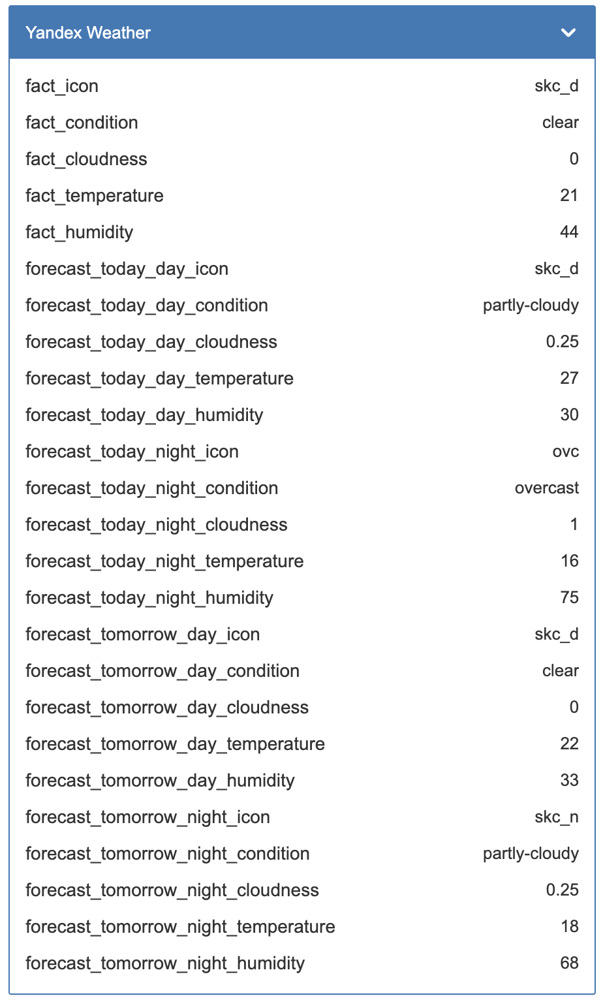
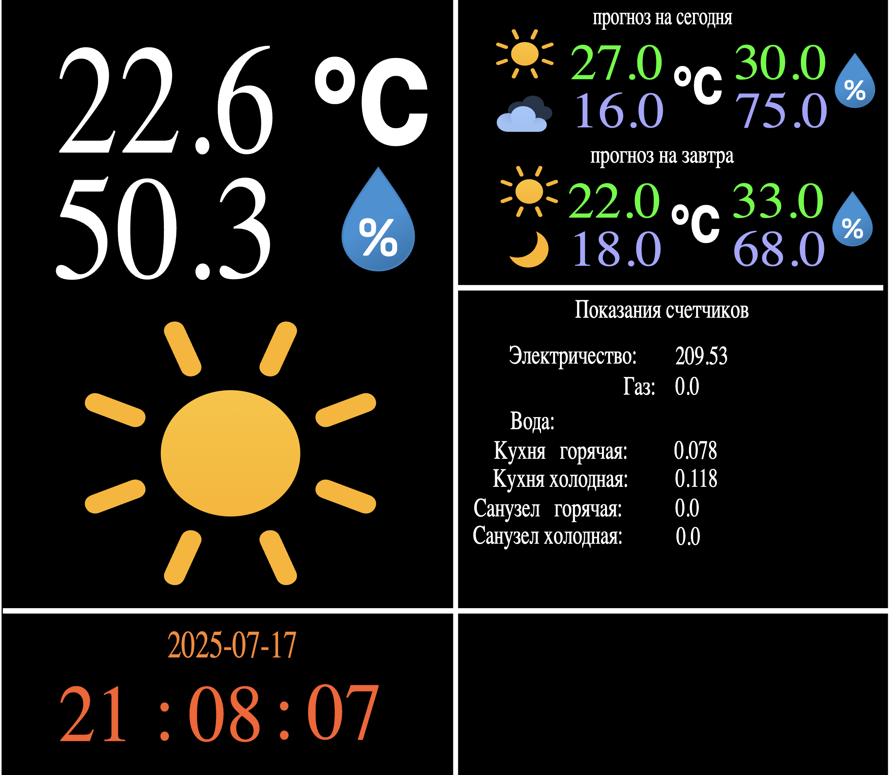

<h1 align="center">
  Дашборд погоды для контроллера умного дома Wirenboard на базе открытого API от Яндекс для умных домов
</h1>

# Состоит из двух частей

## cron скрипт yandex.py 
получает информацио о погоде через API Yandex и публикует основные параметры в MQTT

```bash
apt-get install python3-venv

python3 -m venv yandex

source yandex/bin/activate

pip install paho-mqtt
```
yandex.py положить в /root/yandex/ папку

создать файл в папке /etc/cron.hourly

```bash
#!/bin/bash
cd /root/yandex
source ./bin/activate
export YANDEX_WEATHER_KEY=ключ для Yandex Weather API
export YANDEX_WEATHER_LAT=широта
export YANDEX_WEATHER_LON=долгота
python3 yandex.py
```

установить бит запуска
```bash
chmod +x /etc/cron.hourly/yandex
```

запустить для проверки работы
```bash
/etc/cron.hourly/yandex
```

в результате в списке устройст появится новое устройство



## дашборд для отображения информации weather.svg
    
создать SVG панель загрузив файл weather.svg

замапить цифровые значения на соответсвуюшие каналы

для отображения иконок использовать содержимое файлв svg_mapping.json, вставив в режиме редактирования JSON


В результате вы получите следующий дашборд



для текущей температуры и влажности я использовал modbus rtu уличный датчик, например JLS30H

